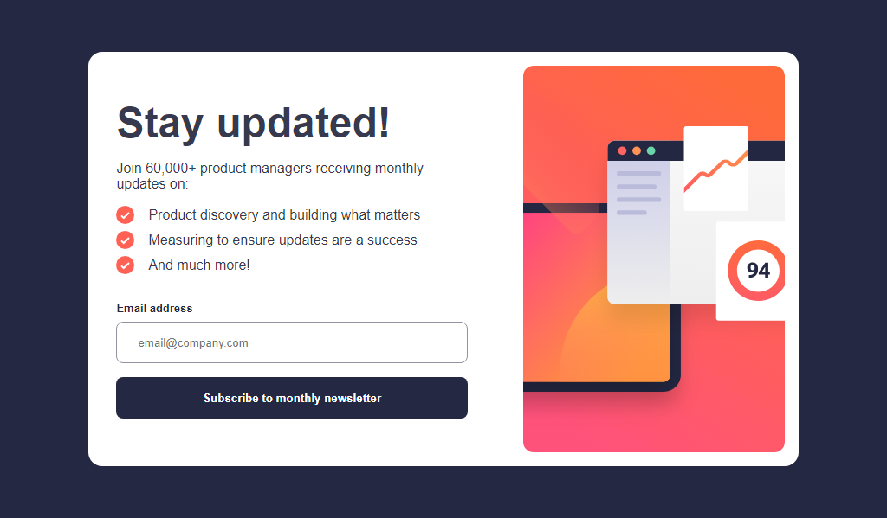

# Frontend Mentor - Newsletter sign-up form with success message solution

This is a solution to the [Newsletter sign-up form with success message challenge on Frontend Mentor](https://www.frontendmentor.io/challenges/newsletter-signup-form-with-success-message-3FC1AZbNrv). Frontend Mentor challenges help you improve your coding skills by building realistic projects. 

## Table of contents

- [Overview](#overview)
  - [The challenge](#the-challenge)
  - [Screenshot](#screenshot)
  - [Links](#links)
- [My process](#my-process)
  - [Built with](#built-with)
  - [What I learned](#what-i-learned)
- [Author](#author)

## Overview

### The challenge

Users should be able to:

- Add their email and submit the form
- See a success message with their email after successfully submitting the form
- See form validation messages if:
  - The field is left empty
  - The email address is not formatted correctly
- View the optimal layout for the interface depending on their device's screen size
- See hover and focus states for all interactive elements on the page

### Screenshot

### Links

- Solution URL: [Newsletter](https://jlsoaresramos.github.io/newsletter-challenge/)

## My process

### Built with

- Semantic HTML5 markup
- Flexbox
- [SASS](https://sass-lang.com/)
- [React](https://reactjs.org/) - JS library
- [Next.js](https://vitejs.dev/) - Vite framework

### What I learned

I'm thrilled to share a recent milestone in my coding journey! In my latest project, I delved into the world of SASS for the first time, and what an eye-opener it turned out to be.

Discovering the power of SASS introduced me to a whole new level of styling. The flexibility of variables, mixins, and nesting syntax significantly improved the structure and maintainability of my stylesheets. It's incredible how a preprocessor like SASS can elevate the entire styling process.

But that's not the only triumph—I successfully deployed the project on GitHub Pages! The journey of configuring settings and witnessing my project live was nothing short of gratifying. What added an extra layer of convenience to the deployment process was using gh-pages, a fantastic tool that simplifies the deployment to GitHub Pages. You can check it out [here](https://github.com/tschaub/gh-pages).

I owe a huge thanks to everyone who has been a part of this learning experience, whether through insightful discussions, helpful tutorials, or good old trial and error. Here's to more coding adventures and the continuous exploration of new technologies on the horizon!

## Author

- Github - [JLSoaresRamos](https://github.com/JLSoaresRamos)
- Frontend Mentor - [@JLSoaresRamos](https://www.frontendmentor.io/profile/JLSoaresRamos)
- Linkedin - [@jlramossoares](https://www.linkedin.com/in/jlramossoares/)
